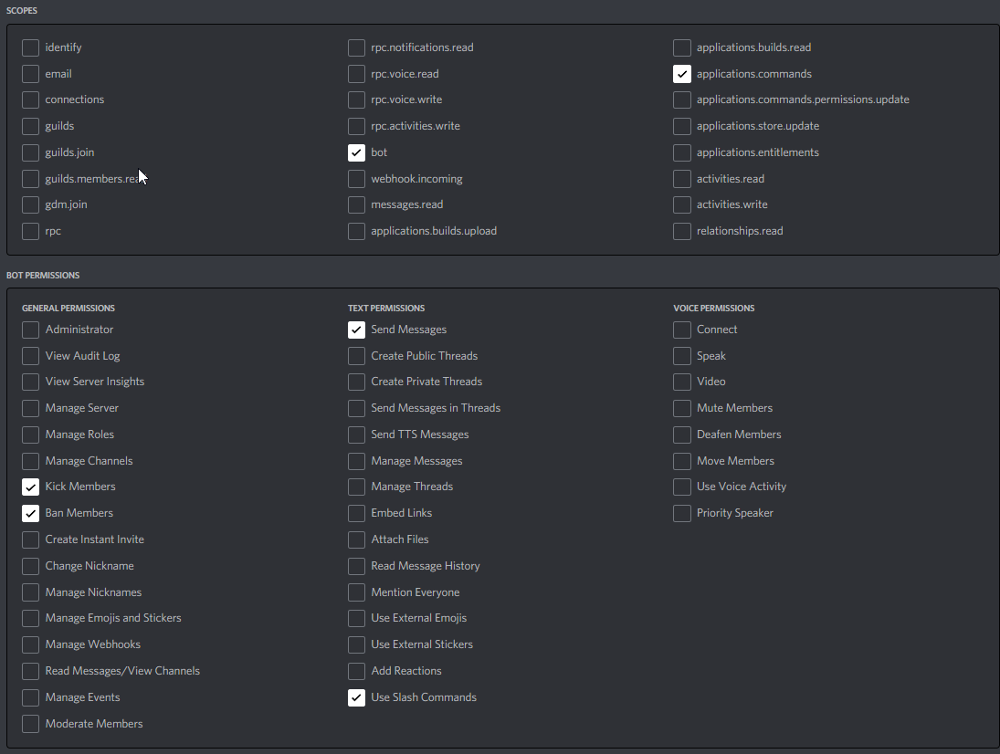
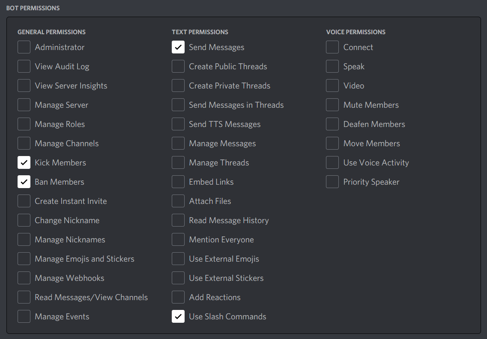
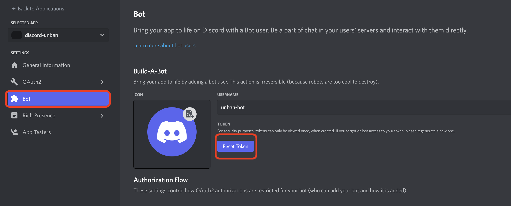

# Mass Discord Unban bot

A discord bot to mass unban users in a server in the event of spam/rogue/malicious bot banning all users or simply to mass unban.


## Setup instructions

### Installing dependencies

First install [Node.js](https://nodejs.org/en/download/current/) v16.9.0 or higher. Or follow this [guide](https://discordjs.guide/preparations/)

Then clone/download this repository and open the folder containing bot files. One of the files should files should be called `index.js`.

Open terminal in that folder (Command prompt, Powershell, Bash, etc) and run this command:

```bash
npm install
```

### Creating & Adding a Bot

#### Creating a Bot

Follow this [guide](https://discordjs.guide/preparations/setting-up-a-bot-application.html) to create the bot.

Navigate to the OAuth2 tab in the Discord Developers Dashboard and select URL Generator.

After input the following settings as shown below(applications.commands IS REQUIRED):



_You may select `Public bot`, but it is not required. If selected anyone can invite your bot. If not, no body except you can invite bot._


#### Adding the bot

Follow this [guide](https://discordjs.guide/preparations/adding-your-bot-to-servers.html) to get bot invite link.

While setting up the invite link, make sure you select these bot permissions:



_You may select Administrator permission instead of the above given permissions so that the bot works flawlessly_

**Note:** You must have `Manage Server` permission or `Administrator` permission on the server where you will be adding the bot.

### Creating config.json

[Guide](https://discordjs.guide/creating-your-bot/#using-config-json)

Copy `Reset Token` from Bot page and copy this token..


Change `example.config.json` to `config.json` and paste the token in the `token` field. 

```js
{
  "token": "insert-bot-token-here"
}
```

## Usage

If you have followed the steps correctly till now, then the basic setup is done!

The only thing remains is to turn on the bot.

Open terminal in the bot folder and run the following command:

```bash
npm start
```

In the terminal window you will see:

```bash
> massdiscordunban@2.0.0 start
> node .

Your bot invite: https://discord.com/api/oauth2/authorize?client_id=<your-client-id>&scope=bot+applications.commands&permissions=2054
Use /unbanall to unban all users
```

Open discord, and use the slash command: `/unban-all`.

Wait for the bot to finish unbanning.

To check if the bot has unbanned all users, go to Server Settings > Bans.
There you should see 0 Bans or `NO BANS`.

# I need HALP!

Incase of any issues, contact:

Ryheff24 on [Twitter](https://twitter.com/Ryheff24) or on Discord: `Ryheff24#6774`

# License

[MIT](./LICENSE)
